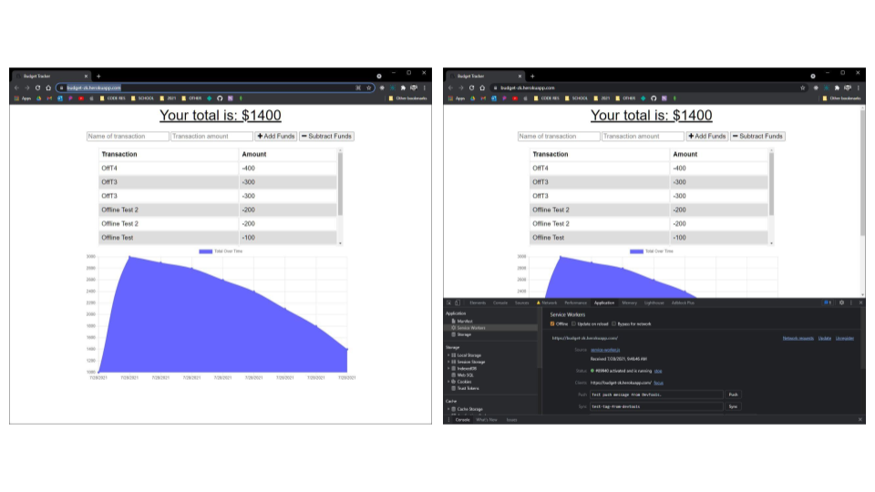

# 20210726 - Budget Tracker 


 ## Table of Contents.
 * [Overview](#overview)
 * [Design](#overview)
 * [Criteria](#given-criteria)
 * [Questions](#have-questions)
 * [Links](#links)
 ---


## Overview 
Tasked to add functionality to existing Budget Tracker application to allow for offline access and functionality.

## Design


Design and UI remained unchanged from provide code.


---
## Given Criteria
WHEN the user inputs a withdrawal or deposit

THEN that will be shown on the page, and added to their transaction history when their connection is back online.

Offline Functionality:

  * Enter deposits offline

  * Enter expenses offline

When brought back online:

  * Offline entries should be added to tracker.


---
## Have Questions
### You can contact me at:

GITHUB: <https://github.com/ZacharyWK>

EMAIL: <ZachKrause@live.com>


---
## Links
[REPOSITORY](https://github.com/ZacharyWK/20210726-budget-tracker-zk)
```
https://github.com/ZacharyWK/20210726-budget-tracker-zk
```

[DEPLOYED](https://budget-zk.herokuapp.com/)
```
https://budget-zk.herokuapp.com/
```

